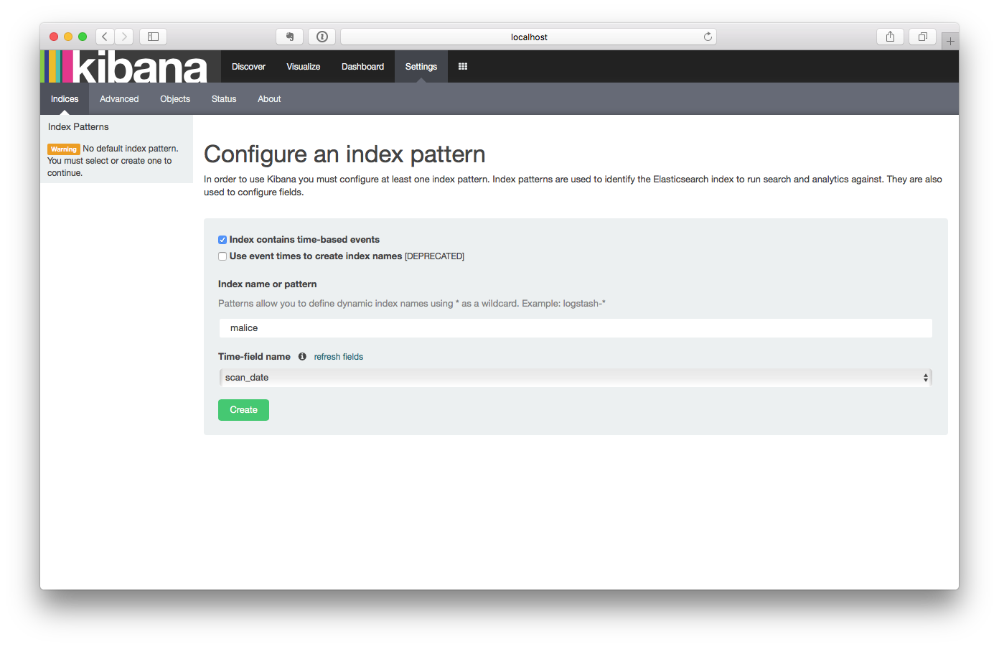
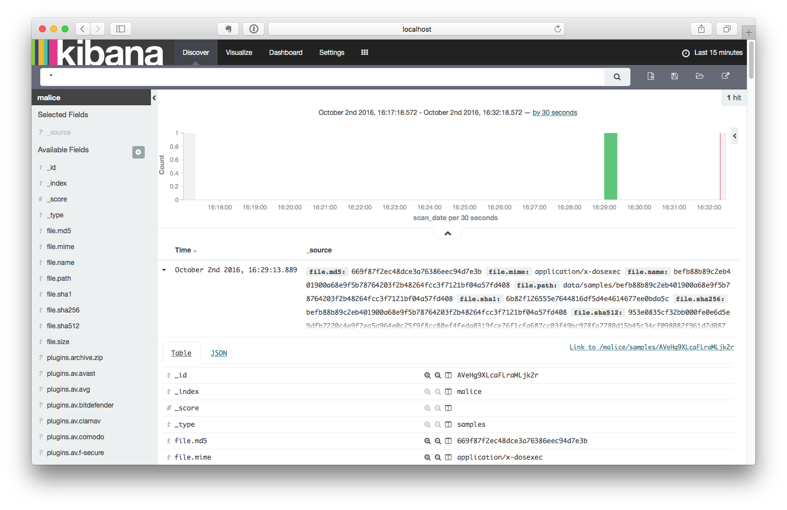

malice
======

[](https://github.com/gmaliceio/malice/releases/latest) [](LICENSE) [](https://travis-ci.org/maliceio/malice) [](https://godoc.org/github.com/maliceio/malice) [](https://codecov.io/gh/maliceio/malice) [](https://gitter.im/maliceio/malice)

Malice's mission is to be a free open source version of VirusTotal that anyone can use at any scale from an independent researcher to a fortune 500 company.

### Setup Docker (OSX)

Install [Docker for Mac](https://docs.docker.com/docker-for-mac/)

-Or-

Install with [homebrew](http://brew.sh).

```bash
$ brew install caskroom/cask/brew-cask
$ brew cask install virtualbox
$ brew install docker
$ brew install docker-machine
$ docker-machine create --driver virtualbox --engine-storage-driver overlay malice
$ eval $(docker-machine env malice)
```

### Getting Started (OSX)

#### Install

```bash
$ brew install maliceio/tap/malice
```

```
Usage: malice [OPTIONS] COMMAND [arg...]

Open Source Malware Analysis Framework

Version: 0.3.11

Author:
  blacktop - <https://github.com/blacktop>

Options:
  --debug, -D  	Enable debug mode [$MALICE_DEBUG]
  --help, -h   	show help
  --version, -v	print the version

Commands:
  scan		Scan a file
  watch		Watch a folder
  lookup	Look up a file hash
  elk		Start an ELK docker container
  plugin	List, Install or Remove Plugins
  help		Shows a list of commands or help for one command

Run 'malice COMMAND --help' for more information on a command.
```

#### Scan some *malware*

```bash
$ malice scan evil.malware
```

> **NOTE:** On the first run malice will download all of it's default plugins which can take a while to complete.

Malice will output the results as a markdown table that can be piped or copied into a **results.md** that will look great on Github see [here](docs/examples/scan.md)

#### Start Malice's Web UI

```bash
$ malice elk
```

> You can open the [Kibana](https://www.elastic.co/products/kibana) UI and look at the scan results here: [http://localhost](http://localhost) (*assuming you are using Docker for Mac*\)



-	Type in **malice** as the `Index name or pattern` and click **Create**.

-	Now click on the `Discover Tab` and **behold!!!**



### Getting Started (*Docker in Docker*\)

[](https://circleci.com/gh/maliceio/malice) [](https://hub.docker.com/r/malice/engine/) [](https://hub.docker.com/r/malice/engine/) [](https://hub.docker.com/r/malice/engine/)

#### Install/Update all Plugins

```bash
docker run --rm -v /var/run/docker.sock:/var/run/docker.sock malice/engine plugin update --all
```

#### Scan a file

```bash
docker run --rm -v /var/run/docker.sock:/var/run/docker.sock \
                -v `pwd`:/malice/samples \
                -e MALICE_VT_API=$MALICE_VT_API \
                malice/engine scan SAMPLE
```

Documentation
-------------

-	[Documentation](docs)
-	[Plugins](docs/plugins)
-	[Examples](docs/examples)
-	[Roadmap](docs/roadmap)
-	[Contributing](CONTRIBUTING.md)

### Known Issues :warning:

I have noticed when running the new **5.0+** version of [malice/elasticsearch](https://github.com/maliceio/elasticsearch) on a linux host you need to increase the memory map areas with the following command

```bash
sudo sysctl -w vm.max_map_count=262144
```

Elasticsearch requires at least **4GB** of RAM to run. You can lower it to **2GB** by running the following *\(**before running a scan**\)*:

```bash
$ docker run -d \
         -p 9200:9200 \
         -name malice-elastic \
         -e ES_JAVA_OPTS="-Xms2g -Xmx2g" \
         malice/elasticsearch
```

### Issues

Find a bug? Want more features? Find something missing in the documentation? Let me know! Please don't hesitate to [file an issue](https://github.com/maliceio/malice/issues/new)

### CHANGELOG

See [`CHANGELOG.md`](https://github.com/maliceio/malice/blob/master/CHANGELOG.md)

### License

Apache License (Version 2.0)  
Copyright (c) 2013 - 2017 **blacktop** Joshua Maine
